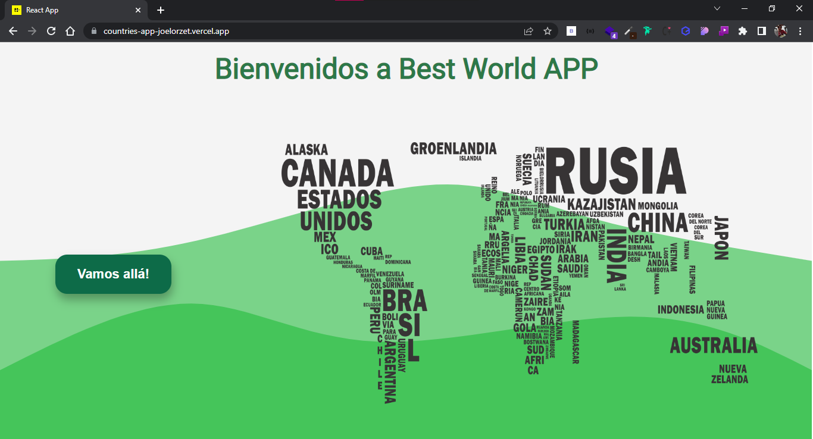
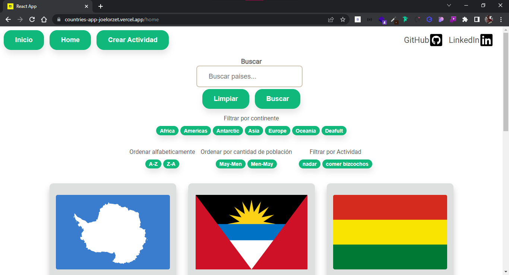
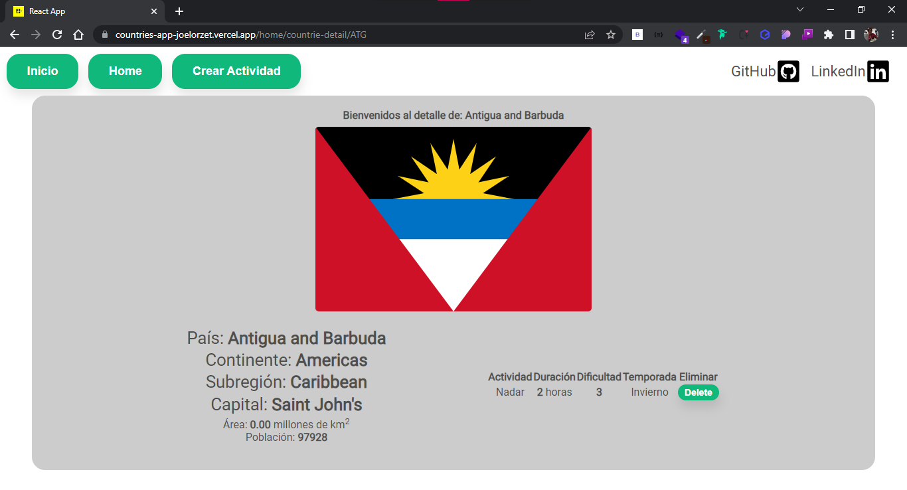
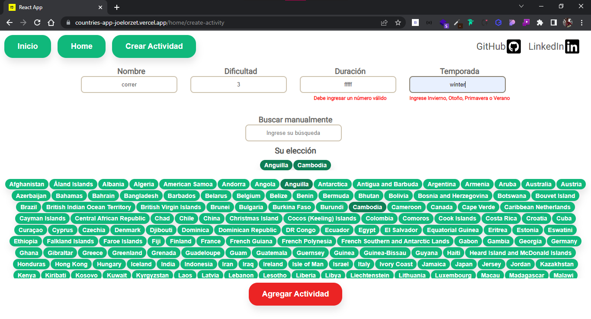

# Hi, I'm Joel! 👋

# Countries Client

This repository is the client of my individual project in the HENRY bootcamp course

## Features

- Search countries
- Sort countries by name
- Sort countries by population ammount
- Create new activity for any ammount of countries

## Run Locally

Clone the project

```bash
  git clone https://github.com/joelorzet/countries-client
```

Go to the project directory

```bash
  cd my-project
```

Install dependencies

```bash
  npm install
```

Start the server

```bash
  npm run start
```

You also gonna need to download the api-repository

https://github.com/joelorzet/countries-api

## 🛠 Skills

React Js, React-Redux, Javascript, HTML, CSS...

## Screenshots






## Tech Stack

**Client:** React, Redux, Javascript ,CSS pure

**Server:** Node, Express, PostreSQL, Sequelize

## 🔗 Links

[](https://www.linkedin.com/in/joelorzet/)
[](https://twitter.com/JoelOrzet)
